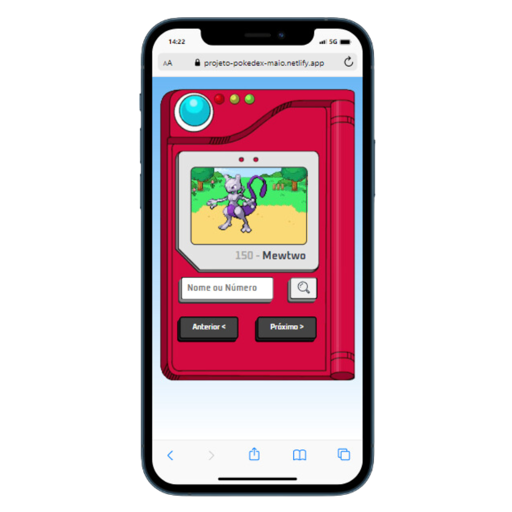

  <h1> Porjeto Pokedéx    </h1>

 Este é um projeto de uma Pokedéx, onde é possível consultar os Pokémons cadastrados. Nele foi consumido a Api da 
  "PokeApi" para pegar os valores da aplicação. 

  
 <h3> Neste projeto utilizei as seguintes tecnologias: </h3>

 
 
 
 

 
 

  <h3> Imagem do projeto </h3>
  
  
  <h3> Link do Projeto </h3>
 
 <a href="https://projeto-pokedex-maio.netlify.app/">Projeto Pokedéx</a>
